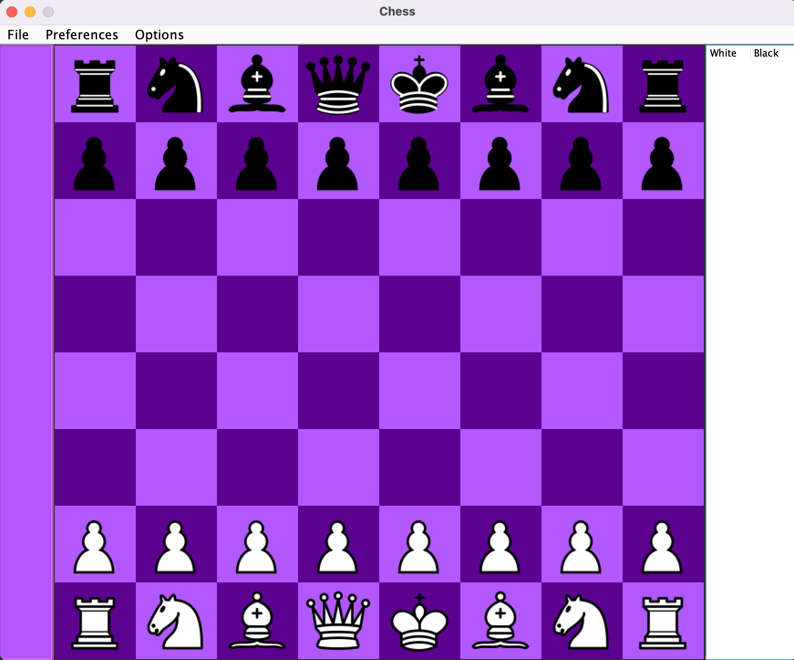

<!---->
<!---->

<h1><strong>Hi! :wave:</strong></h1> 

<h2>About</h3>
My name is <strong>Evan Carr</strong> and I am a student at <a href='https://www.elon.edu/'>Elon University</a>. I am a junior Computer Science major with a minor in Mathematics. 

<h2>Projects</h3>
<h3>Chess Engine AI</h4>
I enjoy playing chess in my free time which led to me to create a desktop app with <em>Java/Swing/MySQL</em>. Since most chess platforms have paywalls, I decided to create my own application to analyze my past games. It included a customized engine and scraped over 2,680,000+ past chess games from previous professional games to use as book moves. It was my first real application so I tried working according to SOLID principles. The design was modeled after chess.com's website and the GUI works similar as well. The GUI follows chess procedure, highlights legal moves for a clicked piece, indicates taken pieces, and displays chess notation of game. The engine uses a minimax algorithm based on piece value, mobility, development, king safety, and pawn structure using object-oriented programming. 
 
 

<!---->

    

<h2>Interests</h3>
Anything computer science interests me, particularly <strong>web development</strong>. Early August I began working on <a href='https://www.theodinproject.com/'>The Odin Project</a> and was super fascinated by the process. Recently, I have been studying various tech stacks outside of class but currently I am learning <em>Java/SpringBoot/REST/Hibernate/MySQL/AngularJS.</em>
 
 
Other than coding, I like collecting sneakers or hanging out with my two dogs. I also enjoy relaxing with my girlfriend watching TV.

<!--
**ejrcarr/ejrcarr** is a ✨ _special_ ✨ repository because its `README.md` (this file) appears on your GitHub profile.

Here are some ideas to get you started:

- 🔭 I’m currently working on ...
- 🌱 I’m currently learning ...
- 👯 I’m looking to collaborate on ...
- 🤔 I’m looking for help with ...
- 💬 Ask me about ...
- 📫 How to reach me: ...
- 😄 Pronouns: ...
- ⚡ Fun fact: ...
-->
